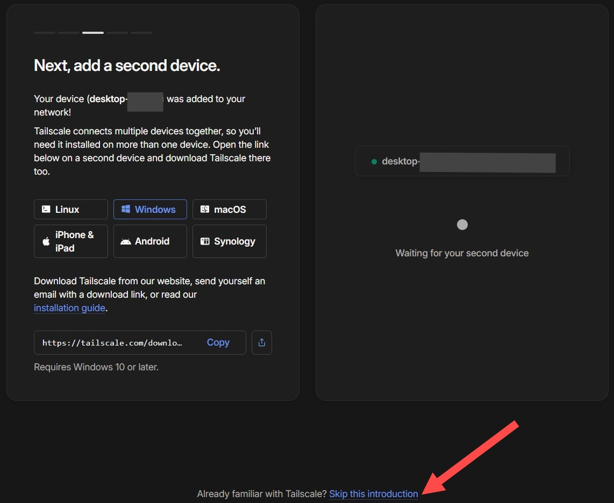

# Computación distribuida sobre un Cluster de Raspberry PIs usando MPI

Este documento constituye la guía oficial para la puesta en marcha, validación y evaluación de rendimiento del clúster de 8 nodos Raspberry Pi 4. La arquitectura utiliza **MPICH** como implementación de MPI, seleccionada por su estabilidad en sistemas ARM y gestión eficiente de redes físicas.

<p align="center">
  
  
</p>

---
## Acceso al Clúster (Red VPN y SSH)

Para interactuar con el clúster desde tu máquina local, debes unirte a la red privada virtual (VPN) del laboratorio mediante **Tailscale** y, posteriormente, iniciar sesión vía SSH en el Nodo Maestro.

### Unirse a la Red de Tailscale
1. Crea una cuenta en TailScale en el siguiente enlace: 👉 **[Enlace de Registro a TailScale](https://login.tailscale.com/start)** **IMPORTANTE:** Debes crear una cuenta o iniciar sesión utilizando obligatoriamente un **correo electrónico personal** (ej. @gmail.com, @outlook.com). El sistema **no permite** el registro con correos institucionales de la universidad.

2.  Contesta la encuesta que pide TailScale, y dale en añadir tu primer dispositivo. **Tailscale** te pedirá descargar su software a través del siguiente enlace: 👉 **[Enlace de Descarga de TailScale](https://tailscale.com/download/windows)**.

3. Selecciona el cliente correspondiente a tu sistema operativo (Windows, macOS, Linux, iOS o Android).

4. Abre la aplicación de Tailscale en tu equipo e inicia sesión utilizando **el mismo correo personal** que utilizaste en el Paso 1.

5. Asegúrate de que el cliente de Tailscale esté activo (estado "Connected" o "Running" en tu barra de tareas).

6. Una vez instalado TailScale, el software reconocerá tu dispositivo y en la página de registro te pedirá añadir un segundo dispositivo, desplázate hacia abajo y dale click en "Saltar esta introducción":

<p align="center">

</p>

8. Entra en el siguiente enlace de invitación para acceder a la red del clúster:
   👉 **[Enlace de Invitación Tailscale](https://login.tailscale.com/admin/invite/6Jf3tBqjDKJn6x9s8Zi811)**

<p align="center">

</p>


### Conexión al Nodo Maestro por SSH
Una vez que Tailscale esté ejecutándose, tu computadora ya se encuentra dentro de la misma red local que el clúster. Ahora usarás la terminal de tu sistema (Símbolo del sistema, PowerShell, Terminal de macOS o Linux) para conectarte al nodo principal.

**Credenciales de Acceso:**
* **IP del Nodo Maestro:** `100.67.252.27`
* **Usuario:** Tu nombre de usuario sigue el formato **S#_de_código_estudiantil** (por ejemplo, si tu código es 1234567, tu usuario será `S1234567`).
* **Contraseña Global:** `9087`

**Ejemplo Práctico de Conexión:**
Si para este ejemplo utilizáramos el usuario de prueba `estudiante2` (o el usuario `docente`), el comando a ingresar en tu terminal sería el siguiente:

**Para el estudiante de prueba:**
```bash
ssh estudiante2@100.67.252.27
```

**Para el docente:**
```bash
ssh docente@100.67.252.27
```

> **📌 Nota sobre el estado actual:** Los usuarios `estudiante2` y `docente` ya se encuentran creados en el Nodo Maestro, debidamente configurados con entornos aislados (sin privilegios `sudo` para prevenir modificaciones accidentales del sistema) y listos para pruebas. Estamos a la espera de la validación final del laboratorio para ejecutar el Playbook de Ansible que automatizará la creación masiva del resto de usuarios definitivos bajo la nomenclatura oficial `S#código_estudiantil`.

**¿Qué sucederá al ejecutar el comando?**

1. **Autenticación del Host:** Si es la primera vez que te conectas, la terminal te informará que la autenticidad del host no puede ser establecida y te mostrará una "huella digital" (fingerprint). Deberás escribir `yes` y presionar Enter. 

2. **Ingreso de Contraseña:** A continuación, te solicitará la contraseña. Escribe `9087` y presiona Enter. 


¡Una vez completado esto, el *prompt* de tu terminal cambiará para indicar que estás dentro del Nodo Maestro.

## 1. Preparación del Entorno de Trabajo

Para garantizar la correcta orquestación de procesos distribuidos, el sistema requiere una estructura de archivos y una configuración de red coherente en todos los nodos.

### 1.1. Creación del Directorio de Ejecución
Por convención, centralizaremos las operaciones de compilación y ejecución en un directorio específico. **Debe crear este directorio explícitamente** en el Nodo Maestro y acceder a él ejecutando:

```bash
mkdir -p ~/mpi_jobs
cd ~/mpi_jobs
```

* **Nota sobre rutas:** El nombre `~/mpi_jobs` es una referencia estándar; es posible utilizar cualquier otra ruta siempre que se ajusten las referencias relativas en los comandos de ejecución.
* **Importante:** Todos los archivos mencionados en esta guía deberán ser creados dentro de este directorio para asegurar su correcta visibilidad en el clúster.

### 1.2. Disponibilidad de Archivos y Rol del NFS
Un requisito fundamental de MPI es que cualquier binario o script debe existir en la **misma ruta absoluta** en todos los nodos participantes. 
* **Desafío:** En clústeres convencionales, esto obligaría a copiar manualmente cada archivo a los 8 nodos.
* **Solución:** Este clúster implementa **NFS (Network File System)**. El directorio `/home` de los nodos esclavos es un espejo en red del Nodo Maestro. Por lo tanto, absolutamente cualquier archivo o directorio creado en el maestro (ya sea en `~/mpi_jobs` o en general en el *home*) se reflejará y será visible instantáneamente en todos los nodos, facilitando la ejecución distribuida sin intervención manual.

### 1.3. Archivo de nodos (`machinefile`)
MPI requiere conocer explícitamente las direcciones IP de las máquinas que empleará para distribuir los procesos.

**Por tanto:** Debe crear el archivo `~/mpi_jobs/machinefile` con el siguiente listado de IPs, que corresponden a las establecidas para cada uno de los nodos en la red ethernet (switch):

```text
10.4.9.212
10.4.8.113
10.4.8.34
10.4.9.85
10.4.9.136
10.4.8.213
10.4.9.225
10.4.8.223
```

---

## 2. Pruebas de Diagnóstico y Conectividad

Validaremos la comunicación base mediante scripts que reportan el rango único (identificador) y el nombre del nodo físico donde se ejecutan.

### 2.1. Prueba en C
**Paso A: Crear el archivo**
Cree el archivo `hello.c` en el Nodo Maestro dentro de `~/mpi_jobs/`. El código fuente necesario para este archivo se encuentra disponible en este mismo repositorio, dentro del directorio `/scripts`.

**Paso B: Compilación y Ejecución**
Desde el directorio `~/mpi_jobs`, compile y ejecute el programa:
```bash
# Compilación mediante el wrapper de MPICH
mpicc.mpich hello.c -o hello

# Ejecución distribuida en los 8 nodos
/usr/bin/mpiexec.mpich -genv UCX_NET_DEVICES=eth0 -n 8 -f machinefile ./hello
```

### 2.2. Prueba en Python
**Paso A: Crear el script**
Cree el archivo `hello.py` en el Nodo Maestro dentro de `~/mpi_jobs/`. El contenido de este script se encuentra en el directorio `/scripts` de este mismo repositorio.

**Paso B: Ejecución Distribuida**
```bash
/usr/bin/mpiexec.mpich -genv UCX_NET_DEVICES=eth0 -n 8 -f machinefile python3 hello.py
```

**Resultado esperado:** Debe visualizar 8 líneas de salida con rangos del 0 al 7. Si algún rango se repite o los nodos no responden, verifique la conectividad física y la integridad del `machinefile`.

---

## 3. Anatomía y Parámetros del Comando MPI

La rigurosidad en la sintaxis de ejecución es vital. Un parámetro faltante puede provocar que los nodos intenten comunicarse por interfaces de red incorrectas (generando un colapso por *Timeout* como el error `UCX ERROR`). Sin embargo, el entorno está diseñado para que experimentes. 

Para que puedas crear, compilar y ejecutar tus propios algoritmos sin romper el sistema, aquí tienes la anatomía de los comandos utilizados, detallando qué debes mantener intacto y con qué puedes "jugar":

**1. Comando de Compilación (C)**
Ejemplo: `mpicc.mpich -O2 mi_script.c -o mi_ejecutable -lm`
* `mpicc.mpich` **[INMUTABLE]:** Llama al compilador específico de nuestra arquitectura. No uses solo `mpicc`.
* `-O2` **[MODIFICABLE]:** Nivel de optimización de la CPU. Puedes cambiarlo a `-O0` (sin optimizar), `-O1` o `-O3` (optimización extrema) para ver cómo afecta el rendimiento.
* `mi_script.c -o mi_ejecutable` **[MODIFICABLE]:** Nombres de tus archivos. Puedes programar tus propios algoritmos en C y simplemente reemplazar estos nombres.
* `-lm` **[CONDICIONAL]:** Necesario e inmutable solo si tu script incluye `<math.h>` (como en el cálculo de Pi).

**2. Comando de Ejecución (C y Python)**
Ejemplo: `/usr/bin/mpiexec.mpich -genv UCX_NET_DEVICES=eth0 -n 8 -f machinefile python3 mi_script.py`
* `/usr/bin/mpiexec.mpich` **[INMUTABLE]:** Ruta estricta del orquestador del clúster.
* `-genv UCX_NET_DEVICES=eth0` **[INMUTABLE]:** Obliga al clúster a enrutar el tráfico por el Switch. Si lo omites o modificas, la red colapsará.
* `-n 8` **[MODIFICABLE]:** Cantidad de nodos a utilizar. **(La variable más importante para experimentar)**. Cámbiala a 1, 2,...y 8 para comparar la aceleración (*Speedup*).
* `-f machinefile` **[INMUTABLE]:** Archivo que mapea las direcciones IP físicas del clúster.
* `python3 mi_script.py` o `./mi_ejecutable` **[MODIFICABLE]:** El programa a ejecutar. Puedes pasarle tus propios scripts de python o binarios compilados de C.


---

## 4. Benchmarking y Análisis de Rendimiento

Mediremos la eficiencia del clúster e identificaremos los límites físicos y lógicos de la mejora de rendimiento.

### 4.1. Cálculo de Pi (Método Monte Carlo)
Utilizaremos el Método de Monte Carlo para calcular el valor de Pi. Este es un problema matemáticamente intensivo ("Vergonzosamente Paralelo") donde los nodos casi no necesitan comunicarse entre sí hasta el final.

**Actividad:** Cree el archivo `pi_montecarlo.c` en `~/mpi_jobs/` copiando el código fuente ubicado en el directorio `/scripts` de este repositorio.

```bash
# Compilación con optimización y enlace matemático (-lm)
mpicc.mpich -O2 pi_montecarlo.c -o pi_montecarlo -lm
```

```bash
# Ejecutar usando 1 solo nodo (Línea Base para medir).
/usr/bin/mpiexec.mpich -genv UCX_NET_DEVICES=eth0 -n 1 ./pi_montecarlo
```
 Ten paciencia. Deberás esperar unos minutos ya que se está ejecutando en un solo nodo.
```bash
# Ejecutar usando 4 nodos
/usr/bin/mpiexec.mpich -genv UCX_NET_DEVICES=eth0 -n 4 -f machinefile ./pi_montecarlo
```

```bash
# Ejecutar usando los 8 nodos del clúster
/usr/bin/mpiexec.mpich -genv UCX_NET_DEVICES=eth0 -n 8 -f machinefile ./pi_montecarlo
```

Realiza lo anterior ajustando el número de nodos en 1 hasta llegar a 8 y registra el tiempo de ejecución para cada una estas configuraciones

### Análisis de Resultados: Speedup y Ley de Amdahl

Una vez obtenidas tus mediciones, es momento de calcular matemáticamente el *Speedup* (Aceleración) de nuestro clúster. El Speedup ($S$) se define como el tiempo de ejecución estrictamente secuencial ($T_1$) dividido por el tiempo de ejecución en paralelo ($T_p$):

* **Fórmula:** $S = \frac{T_1}{T_p}$

**Calcula tu propio Speedup:** Divide el tiempo en segundos que registraste usando 1 solo nodo entre el tiempo obtenido al usar los 8 nodos del clúster. 


> **Pregunta de Análisis 1:** Al realizar tu cálculo, notarás que la aceleración obtenida se acerca a un factor lineal (idealmente cercano a 8x), pero nunca llega a ser exactamente 8. Según los principios de la **Ley de Amdahl**, ¿qué partes específicas del código `pi_montecarlo.c`  crees que representan la "fracción secuencial" que impide que la aceleración sea perfecta?

> **Actividad Propuesta (Gráfica de Rendimiento):** > 1. Tabula los tiempos de ejecución que registraste para 1, 2, ... y 8 nodos. 
> 2. Calcula el Speedup correspondiente para cada una de esas configuraciones.
> 3. Crea una gráfica donde el eje horizontal (X) sea el "Número de Nodos" (1, 2, 4, 8) y el eje vertical (Y) sea el "Speedup Calculado". 
> 4. En esa misma gráfica, traza una línea recta ideal ($y=x$, donde 2 nodos dan 2x de speedup, 4 dan 4x, etc.).
> 
> *Pregunta de Análisis 2:* Al comparar la curva real de tus datos con la línea ideal, ¿qué tendencia observas a medida que aumentas la carga de 4 a 8 nodos? Si teóricamente agregáramos 100 nodos más al clúster, ¿crees que la curva seguiría subiendo o comenzaría a aplanarse (hacerse asintótica)? Justifica tu respuesta basándote en la Ley de Amdahl.

### 4.2. Búsqueda de Primos (Balanceo Dinámico)

Calcular si un número grande es primo toma más trabajo de CPU que comprobar un número pequeño. Si dividimos el trabajo en partes iguales fijas (estáticas), un nodo terminaría mucho antes que otro y se quedaría ocioso esperando. 

Para evitar esto, usamos un patrón **(Master-Worker)**. El Nodo 0 actúa como despachador, dividiendo la tarea en pequeños "paquetes" o *chunks*. Cuando un nodo termina su paquete, le pide otro al Maestro. Esto es el **Balanceo de Carga Dinámico**.

**Actividad:** Cree el archivo `buscador_primos.py` en `~/mpi_jobs/` copiando el contenido del script ubicado en el directorio `/scripts` de este repositorio.
```bash
# Ejecutar con 2 nodos (1 Maestro despachador, 1 Trabajador) con 1 solo nodo el script generara un error ya que el algoritmo espera un minimo de 2 nodos
/usr/bin/mpiexec.mpich -genv UCX_NET_DEVICES=eth0 -n 2 -f machinefile python3 buscador_primos.py

# Ejecutar con los 8 nodos (1 Maestro, 7 Trabajadores)
/usr/bin/mpiexec.mpich -genv UCX_NET_DEVICES=eth0 -n 8 -f machinefile python3 buscador_primos.py
```
En los resultados deberías notar tiempos drásticamente diferentes al escalar los nodos(Pasar de 2 nodos a 8 nodos por ejemplo). Aquí entra en juego el delicado balance entre computar datos (CPU) y enviar datos (Red).

> **Actividad Propuesta (Modificando Parámetros de Red):** Abre el archivo `buscador_primos.py`. Cambia la variable `tamano_chunk` de `50000` a `10` (es decir, el maestro enviará paquetes de solo 10 números por vez). Guarda y ejecuta de nuevo la prueba con 8 nodos.

> **Pregunta de Análisis 3:** Al reducir el `tamano_chunk` a 10, ¿el tiempo total de ejecución aumentó o disminuyó drásticamente? Justifica tu respuesta. 
